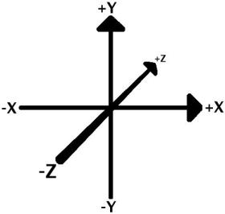

# Hello World with BabylonJS 

Build a "Hello Babylon Scene" and later extend it with interactions to enable placement of meshes with drag and drop, and then save that scene.  We'll also explore the BabylonJS [Playground](https://playground.babylonjs.com/#5883JJ), [Sandbox](https://sandbox.babylonjs.com), [Documentation](https://doc.babylonjs.com) and other online tools. Rather than re-inventing each module we'll reference many of the great online resources at starting points for our exploration.  

### What we will learn:
 - Create a basic Babylon webpage template
 - Create a basic 3D scene with createScene() method
 - Add a camera
 - Create a Mesh from scratch
 - Add Mouse Pointer interactions 
 - Call the BABYLON API to save the scene

## Babylon HTML Template

The basic template we'll use contains the BabylonJS frameworks, CSS styles, a canvas element and a basic script that renders the experience on the canvas.  Since we want to make the experience interactive with realtime streaming and spatial audio communications, we'll be adding additional frameworks and scripts to our basic template.

<!-- [basic-html-template](basic-html-template.md ':include') -->

## Create a basic 3D scene
Let's look at the code for this example. If you do not see it, toggle between the Playground's 3D view and code by tapping the </> code icon in the lower left. 

[Basic Scene](https://playground.babylonjs.com/#5883JJ ':include :type=iframe width=100% height=800px')

Alternatively, [Launch](https://playground.babylonjs.com/#5883JJ) this example in a new window. 

 
First off the code you see here in the playground is just a portion of the full application. If you want to see the completed code for this example, select download, found in the hamburger menu in the upper left corner.

The playground's main focus in on a single method. It's a method called **``createScene``**, this is main method where you create your 3D objects, sometimes referred as nodes; such as **Cameras**, **Ground**, **Lights** and **Meshes** that make up the scene.  Here is where you write code to create the scene. 

Let's walk through the code sequence:

#### Create the scene
 The first line of code creates a basic Babylon Scene object (non-mesh)

```js
var scene = new BABYLON.Scene(engine);
```
#### Add a camera
 Every scene must have one or more cameras. The camera defines the view that will be rendered on the canvas. We create the camera by defining a type of camera; in this case a ``FreeCamera``, we assign a name for the camera and set the camera's initial position in the scene.  
  ``` new BABYLON.FreeCamera("camera1", new BABYLON.Vector3(0, 5, -10), scene)``` The position is expressed as a Vector3: An array of 3 floats  [0.0, 5.0, -10.0] in this case [X,Y,Z].

Now, consider [0,0,0] is the center of the scene, so positive numbers are up and to the right of center. So the camera's initial position is up and away by 10 units. 



 We also need to point the camera a direction, we do so by setting the camera's target to point to the origin of the scene ```BABYLON.Vector3.Zero()``` is a convenience method. Like most  3D programs BabylonJS uses ```Vector3``` as way to set things like direction, position and scale.  
 
!> **Try it Out:**  Take a moment to play with the camera position and target. 

If you set the camera's Z coordinate to - 50  new BABYLON.Vector3(0, 5, -50) the camera will be farther away from the scene's center which is where the model and camera target is pointed.


```js
var camera = new BABYLON.FreeCamera("camera1", new BABYLON.Vector3(0, 5, -50), scene);

// This targets the camera to scene origin
camera.setTarget(BABYLON.Vector3.Zero());

// This attaches the camera to the canvas
camera.attachControl(canvas, true); 
```

#### Light the scene
We create HemisphericLight with a name, direction and the scene.

```js
// This creates a light, aiming 0,1,0 - to the sky (non-mesh)
var light = new BABYLON.HemisphericLight("light", new BABYLON.Vector3(0, 1, 0), scene);

// Default intensity is 1. Let's dim the light a small amount
light.intensity = 0.7;
```
#### Add the meshes and return the scene
The BABYLON.MeshBuilder allows you to create many different mesh shapes, here we create a sphere and a ground plane and finally return the scene.  The main application calls createScene() and updates the canvas with any changes to the scene.

```js
// Our built-in 'sphere' shape.
var sphere = BABYLON.MeshBuilder.CreateSphere("sphere", {diameter: 2, segments: 32}, scene);

// Move the sphere upward 1/2 its height
sphere.position.y = 1;

// Our built-in 'ground' shape.
var ground = BABYLON.MeshBuilder.CreateGround("ground", {width: 6, height: 6}, scene);

return scene;

```
!> **Note:**  By default the scene is rendered gray. This next example shows how to create and assign a material to the ground mesh. Just insert in the code anywhere after the creation of the ground mesh and before returning the scene.
 
``` 
var redMat = new BABYLON.StandardMaterial("redMaterial", scene);
  redMat.diffuseColor = new BABYLON.Color3(0.4, 0.4, 0.4);
  redMat.specularColor = new BABYLON.Color3(0.4, 0.4, 0.4);
  redMat.emissiveColor = new BABYLON.Color3.Red();
  ```

#### Full Code Example:
```js
var createScene = function () {
  // This creates a basic Babylon Scene object (non-mesh)
  var scene = new BABYLON.Scene(engine);

  // This creates and positions a free camera (non-mesh)
  var camera = new BABYLON.FreeCamera("camera1", new BABYLON.Vector3(0, 5, -10), scene);

  // This targets the camera to scene origin
  camera.setTarget(BABYLON.Vector3.Zero());

  // This attaches the camera to the canvas
  camera.attachControl(canvas, true);

  // This creates a light, aiming 0,1,0 - to the sky (non-mesh)
  var light = new BABYLON.HemisphericLight("light", new BABYLON.Vector3(0, 1, 0), scene);

  // Default intensity is 1. Let's dim the light a small amount
  light.intensity = 0.7;

  // Our built-in 'sphere' shape.
  var sphere = BABYLON.MeshBuilder.CreateSphere("sphere", {diameter: 2, segments: 32}, scene);

  // Move the sphere upward 1/2 its height
  sphere.position.y = 1;

  // Our built-in 'ground' shape.
  var ground = BABYLON.MeshBuilder.CreateGround("ground", {width: 6, height: 6}, scene);

  var redMat = new BABYLON.StandardMaterial("redMaterial", scene);
  redMat.diffuseColor = new BABYLON.Color3(0.4, 0.4, 0.4);
  redMat.specularColor = new BABYLON.Color3(0.4, 0.4, 0.4);
  redMat.emissiveColor = new BABYLON.Color3.Red();

  ground.material = redMat;

  return scene;
};

```